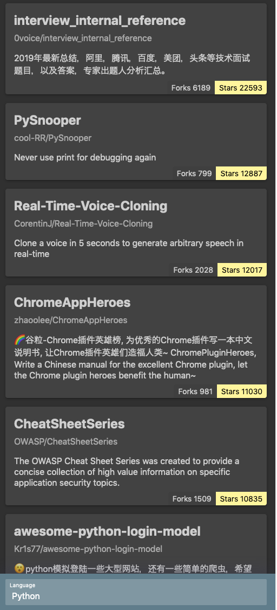
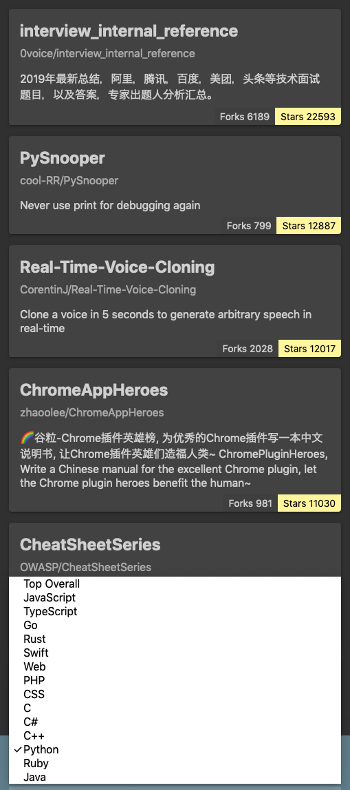
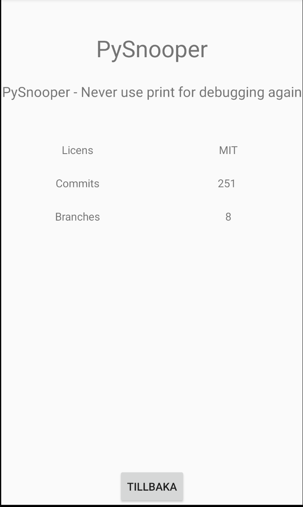

# Lab 3

## Task
Create an application that for a given programming language shows which GitHub repositories are recently the most popular. GitHub has a feature to show which projects and developers are most actively discussed during a given time period (Trending). GitHub's Trending ranking is based on the number of stars given during a given period of time, with a certain adaptation to stop manipulation from outside. Your task is to create an application that is similar to GitHub's Trending page.
Basic requirements for the application:

The application must navigate between multiple screen views
Repositories must be sorted based on some metric that shows popularity, such as the current number of stars
Fetched repositories must be filtered by a time interval, based on either the date of the latest update or the repository creation date
User interface examples (these are only for inspiration, you will create your own design)

<div style="display: flex; gap: 10px;">
  
  
  
</div>


## Results


## Get started

1. Install dependencies

   ```bash
   npm install
   ```

2. Start the app

   ```bash
    npx expo start
   ```

In the output, you'll find options to open the app in a

- [development build](https://docs.expo.dev/develop/development-builds/introduction/)
- [Android emulator](https://docs.expo.dev/workflow/android-studio-emulator/)
- [iOS simulator](https://docs.expo.dev/workflow/ios-simulator/)
- [Expo Go](https://expo.dev/go), a limited sandbox for trying out app development with Expo

You can start developing by editing the files inside the **app** directory. This project uses [file-based routing](https://docs.expo.dev/router/introduction).
